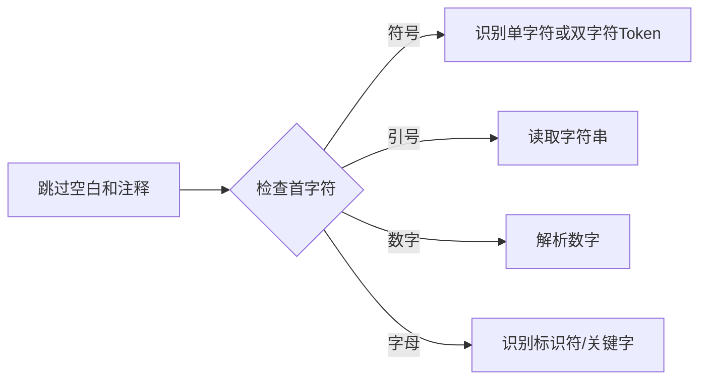

# 利用Rust语言实现lox语言解释器

## 项目概述

使用Rust语言实现了Lox的解释器，参考资料：

[《Crafting Interpreters》](https://craftinginterpreters.com/)

[pylox(github)](https://github.com/sco1/pylox)

使用递归下降的方法构建的语法树以树遍历解释器。

## 系统设计与实现细节

设计分工：

>lier：词法分析(token.rs、lexer.rs)、语法分析(ast.rs、parser.rs)
>神秘男子a: 解释器设计(interpreter.rs)
>神秘男子b: 错误处理

### 词法分析

#### 核心设计

1. **Token枚举**：统一表示所有词法单元

   ```rust
   pub enum Token {
       // 符号：LeftParen, BangEqual 等
       Identifier(String),  // 变量/函数名
       String(String),      // 字符串
       Number(f64),         // 数字
       // 关键字：If, Class, While 等
       Eof,                 // 文件结束
   }
   ```

2. **Lexer结构**：基于Peekable迭代器

   ```rust
   pub struct Lexer<'a> {
       input: Peekable<Chars<'a>>, // 带预览的字符流
   }
   ```

#### 关键机制

1. **双字符处理**：单次前瞻匹配

   ```rust
   '=' => {
       self.input.next();
       if self.match_char('=') { Token::EqualEqual } 
       else { Token::Equal }
   }
   ```

2. **类型系统表示**：

   - 基础类型：`Number(f64)`/`String`/`True`/`False`
   - 结构类型：`Class`/`Fun`关键字
   - 变量：`Var`关键字+`Identifier`

3. **解释流程**：



4. **Rust特性**：

- 模式匹配处理字符分支
- 生命周期管理字符串引用
- Peekable迭代器零成本抽象

### 语法分析

#### 核心设计

1. **AST 结构**：

   ```rust
   enum Stmt { // 语句：函数/类/控制流
       Function { name: Token, params: Vec<Token>, body: Vec<Stmt> },
       Class { name: Token, superclass: Option<Expr>, methods: Vec<Stmt> },
       If { condition: Expr, then_branch: Box<Stmt>, else_branch: Option<Box<Stmt>> }
   }
   
   enum Expr { // 表达式：运算/调用/属性
       Binary { left: Box<Expr>, operator: Token, right: Box<Expr> },
       Call { callee: Box<Expr>, arguments: Vec<Expr> },
       Get { object: Box<Expr>, name: Token }
   }
   ```

#### 关键机制

1. **递归下降解析**：

   ```mermaid
   graph TB
   A[parse] --> B[declaration]
   B -->|class| C[类声明]
   B -->|fun| D[函数声明]
   B -->|var| E[变量声明]
   B --> F[statement]
   F -->|if| G[条件解析]
   F -->|for| H[循环解析]
   ```

2. **类型系统映射**：
   - **变量**：`Stmt::Var` + `Expr::Variable`
   - **函数**：`Stmt::Function` + `Expr::Call`
   - **类**：`Stmt::Class` + `Expr::Get/Set`
   - **继承**：`superclass: Option<Expr>`

3. **优先级处理**：

   ```rust
   expression → assignment
   assignment → logic_or ( = assignment )?
   logic_or → logic_and ( or logic_and )*
   // ... 直至 primary
   ```

#### Rust 特性应用

1. **模式匹配**：

   ```rust
   match self.peek() {
       Token::Class => self.class_declaration(),
       Token::If => self.if_statement(),
       _ => self.expr_statement()
   }
   ```

2. **错误恢复**：

   ```rust
   fn synchronize(&mut self) {
       while !self.is_at_end() {
           match self.peek() {
               Token::Semicolon => return,
               Token::Class | Token::Fun | Token::Var => return,
               _ => self.advance()
           }
       }
   }
   ```

3. **递归数据结构**：使用 `Box` 处理嵌套 AST

#### 关键算法


#### 解释器机制

1. **解析流程**：
   - 按声明/语句粒度递归解析
   - 表达式按优先级层次处理
   - 语法糖转换（如 for→while）

```rust
// for循环转while
fn for_statement(&mut self) -> Stmt {
    let (init, cond, inc) = /* 解析子句 */;
    Stmt::Block(vec![
        init,
        Stmt::While {
            condition: cond.unwrap_or(true),
            body: Box::new(Stmt::Block(vec![
                body, 
                Stmt::Expr(inc.unwrap_or_default())
            ]))
        }
    ])
}
```

2. **上下文跟踪**：`function_depth` 控制 return 有效性

### 解释器实现

<!-- TODO:佟一飞, 介绍解释器实现方案
使用的主要语言特性（Rust语法机制）
如何表达 Lox 的类型系统（变量、函数、类等）
解释器的运行机制
可附上简要代码块或伪代码
 -->

#### 整体框架

为多条语句，单条语句以及表达式设计了遍历AST的方式。在遍历多条语句的时候，如果其中某条语句执行了return，则停止遍历后续语句。

```rust
pub fn traverse_statements(statements: &Vec<Stmt>,depth: usize,map: &mut HashMap<(String,String), Option<Rc<RefCell<Value>>>>,
    env: Framelist,obj :Option<Rc<RefCell<Value>>>,cur_class: Option<String>) ->Ret{//遍历多条语句
    for stmt in statements {
        let val: Ret = traverse_stmt(stmt,depth,map,env.clone(),obj.clone(),cur_class.clone());
        if val.exit {
            return val;
        }
    }
    Ret {
        exit: false,
        value: Some(Rc::new(RefCell::new(Value::Nil))),
    }
}
```

为了实现该机制，把所有AST遍历函数的返回值都设置为```(是否return，具体Value)```的二元组。

在单语句遍历的时候，匹配当前语句的类型决定接下来如何遍历：
```rust
pub fn traverse_stmt(stmt: &Stmt,depth: usize,map: &mut HashMap<(String,String), Option<Rc<RefCell<Value>>>>,
    env: Framelist,obj :Option<Rc<RefCell<Value>>>,cur_class: Option<String>) -> Ret{ //遍历单条语句
    match stmt {
        Stmt::Expr(expr) => {//表达式语句
            ...
        }
        Stmt::Print(expr) => {//打印语句
            ...
        }
        Stmt::Var { name, initializer } => {//变量声明语句
            ...
        }
        //更多情况
    }
}
```
表达式遍历的时候也类似地匹配表达式的类型。

#### 语言特性

使用了所有权机制，在解释器中使用了```Value```表示变量，函数，实例等类型，在过程间传递```Value```以及在容器中存储的时候都用```Option<Rc<RefCell<Value>>>```包装，其中```Option```表示对应指针可能为空，```Rc```表示实现了引用计数的智能指针，使得多个指针可以指向同一个对象。```RefCell```控制指针指向对象的借用，同一时间只能有一个指针借用所指向的对象。

在将一个```Value```包装为上述形式的时候，采用```Some(Rc::new(RefCell::new(value)))```的方式包装。

如果想读取或者修改指针指向的```Value```，则需要按照下面的例子：
```rust
match obj_value {
    Some(rc_value) => {
        let value = rc_value.borrow();//需要修改则替换为可修改借用
        if let Value::Instance { name: instance_name, fields } = &*value {
            ...
        }
    }
    None => ...
}
```

#### Lox 类型系统实现

用```Value```表示所有的变量，函数，实例以及类定义。具体定义如下：
```rust
#[derive(Debug, Clone)]
pub enum Value {//值类型
    Number(f64),
    String(String),
    Bool(bool),
    Nil,
    Null,
    Function {//函数
        name: Framelist,//定义函数时其在哪个作用域
        frame: HashMap<(String,String),Option<Rc<RefCell<Value>>>>,//该作用域的符号表
        params: Vec<Token>,//函数参数
        body: Vec<Stmt>,//函数体
        obj_bind: Option<Rc<RefCell<Value>>>,//函数是哪个实例的成员函数（没有则为空指针）
        class_def: Option<String>,//在哪个类定义中被定义
        func_name: String,//函数名称
    },
    Classdef {//类定义
        name: String,//类名称
        superclass: String,//基类
        methods: Vec<Stmt>,//类的所有方法
    },
    Instance {//实例
        name: String,//是哪个类的实例
        fields: HashMap<(String,String), Option<Rc<RefCell<Value>>>>,//实例的符号表
    },
}
```

#### 解释器主要机制

1. **表达式计算**

对于一个表达式类型，读取这个二元（一元）运算的运算符，再读取子节点表达式的值，进行计算，例如：

```rust
match operator.lexeme() {
    "+" => {
        if isnumber==true{
            result = Some(Rc::new(RefCell::new(Value::Number(left_num + right_num))));
        } else {
            result = Some(Rc::new(RefCell::new(Value::String(format!("{}{}", left_string, right_string)))));
        }
    }
    "-" => result = Some(Rc::new(RefCell::new(Value::Numbe(left_num - right_num)))),
    "*" => result = Some(Rc::new(RefCell::new(Value::Numbe(left_num * right_num)))),
    "/" => {
        if right_num != 0.0 {
            result = Some(Rc::new(RefCell::new(Value::Number(left_num / right_num))));
        } else {
            println!("  Error: Division by zero");
        }
    }
}
```

2. **作用域**

实现了如下的作用域链，为每一个作用域分配一个随机字符串表示其名字：

```rust
#[derive(Debug, Clone)]
pub struct Framelist{//作用域链
    pub next: Option<Box<Framelist>>,
    pub frame: String,
}
```

然后符号表的key定义为```(String,String)```，第一个表示变量名，第二个表示作用域名

3. **控制流**

对于if语句，先计算其条件表达式，再决定进入if分支还是else分支（如果有）：

```rust
Stmt::If { condition, then_branch, else_branch } => {//条件语句
    let cond: Option<Rc<RefCell<Value>>> = traverse_expr(condition, depth + 1, map, env.clone(), obj.clone(), cur_class.clone());
    if let Some(ref rc_cond) = cond {
        let cond_value = rc_cond.borrow();
        if let Value::Bool(true) = &*cond_value {
            let ret: Ret = traverse_stmt(then_branch, depth + 1, map, env.clone(), obj.clone(), cur_class.clone());
            if ret.exit {
                return ret;
            }
        } 
        else if let Value::String(s) = &*cond_value {
            let ret: Ret = traverse_stmt(then_branch, depth + 1, map, env.clone(), obj.clone(), cur_class.clone());
            if ret.exit {
                return ret;
            }
        }
        else {
            if let Some(else_branch) = else_branch {
                let ret: Ret = traverse_stmt(else_branch, depth + 1, map, env.clone(), obj.clone(), cur_class.clone());
                if ret.exit {
                    return ret;
                }
            }
        }
    }
    Ret {
        exit: false,
        value: Some(Rc::new(RefCell::new(Value::Nil))),
    }
}
```

对于while语句，进入一个循环，先计算条件表达式，再决定是否跳出循环，如果不跳出循环，遍历循环体：

```rust
Stmt::While { condition, body } => {//while循环语句
    loop {
        let cond: Option<Rc<RefCell<Value>>> = traverse_expr(condition, depth + 1, map, env.clone(), obj.clone(), cur_class.clone());
        if let Some(ref rc_cond) = cond {
            let cond_value = rc_cond.borrow();
            if let Value::Bool(false) = &*cond_value {
                break;
            }
        }
        let ret: Ret = traverse_stmt(body, depth + 1, map, env.clone(), obj.clone(), cur_class.clone());
        if ret.exit {
            return ret;
        }
    }
    Ret {
        exit: false,
        value: Some(Rc::new(RefCell::new(Value::Nil))),
    }
}
```

4. **函数**

在遍历到函数定义的时候，根据前面定义的函数类型```Value```的定义填充符号表。如果是某个类的函数，则填充该函数绑定的实例的符号表。

5. **类**

在遍历到类定义得到时候，先把这个定义加载到符号表。在定义类的实例的时候，根据类名查找到这个定义，然后遍历符号表中存储的类定义的所有方法，把这些方法加载到实例的符号表中。注意也要加载基类的所有方法。执行该类的init方法，如果找不到则一直向上查找基类的init直到找到。如果仍然找不到则不执行init。

对于set类型的表达式，在实例符号表中找对应字段，将新的值放入实例对应符号表中即可。

对于get类型的表达式，在实例符号表中找对应字段，返回查询结果。

对于this类型的表达式，因为每一个函数都有一个绑定的实例，返回这个实例即可。

对于super类型的表达式，因为super.后面跟的一定是一个方法，所以根据当前函数在哪个类中被定义，在基类中找到.后面跟的方法返回。


### 错误处理

<!-- TODO:杨杰, 错误处理实现方案
使用的主要语言特性（Rust语法机制）
如何表达 Lox 的类型系统（变量、函数、类等）
解释器的运行机制
可附上简要代码块或伪代码
 -->

#### 主要思路

在intepreter上进行修改，增加了存储错误类型的bool原子类型```GLOBAL_ERR```，初始值为false，各类错误判断一旦判断到了要求的语法错误修改将GLOBAL_ERR修改为true，每一层解释器一旦遇到GLOBAL_ERR为true的情况直接返回空指针，实现了错误发生后程序马上中止。

#### 语言特性

使用了原子类型实现了全局的错误处理判断，一旦遇到指定情况修改对应的原子类型，对比互斥锁的优势是没有锁操作性能较高，线程安全无需unsafe，同时支持代码需要的原子操作，具体代码如下：

```rust
pub static GLOBAL_ERR: AtomicBool = AtomicBool::new(false);
pub static GLOBAL_FUNC: AtomicBool = AtomicBool::new(false);
pub static GLOBAL_CLASS: AtomicBool = AtomicBool::new(false);

if GLOBAL_ERR.load(Ordering::SeqCst) == true {
    ……//对于原子类型的读操作示例
}

GLOBAL_FUNC.store(true, Ordering::SeqCst);//对于原子类型的写操作示例
```

#### 具体语法错误处理

由于错误处理类型较多，这里只列出出现频率较多的错误的处理流程。

1. **变量未定义和调用未定义方法/字段**

在有关类的方法/字段解析时把GLOBAL_CLASS赋值为true，解析完毕后重新赋值为false，这样当进入单变量解析时，我们就能分辨该变量是普通变量还是类内的方法/字段，具体代码如下：

```rust
Expr::Variable(token) => {//变量表达式
    let mut cur_env: Framelist = env.clone();
    loop {
        if let Some(value) = map.get(&(token.lexeme().to_string(), cur_env.frame.clone())) {
            return value.clone();
        }
        match &cur_env.next {
            Some(next) => cur_env = (**next).clone(),
            None => break, // No more environments to check
        }
    }
    if GLOBAL_CLASS.load(Ordering::SeqCst) == true {
        println!("RuntimeError: Undefined property '{}'.", token.lexeme());
        GLOBAL_ERR.store(true, Ordering::SeqCst);//有关类的方法/字段未定义
    } else {
        println!("RuntimeError: Undefined variable '{}'.", token.lexeme());
        GLOBAL_ERR.store(true, Ordering::SeqCst);//普通变量未定义
    }
    Some(Rc::new(RefCell::new(Value::Nil))) // Return Nil if variable not found
}
```

2. **类型不匹配操作**

针对二元运算表达式的错误处理，在解释器的基础上判断两个运算数的类型是否一致，如果不一致直接给GLOBAL_ERR赋值为true并输出错误，具体代码如下：

```rust
let left_string = match left_value {
    Some(ref rc_left) => {
        let left_value = rc_left.borrow();
        match &*left_value {
            Value::String(s) => {
                if isnumber == true{
                    type_conflict = true;
                }
                s.clone()
            },
            _ => String::new(),
        }
    },
    None => String::new(),
};

……//右运算数的判断处理同上

if type_conflict == true {
    println!("RuntimeError: Operands must be two numbers or two strings.");
    GLOBAL_ERR.store(true, Ordering::SeqCst);
}//运算数类型冲突
```

## 测试与验证

- 2025-06-06

所有的除存在语法错误的情况以覆盖，总得分30/40, 只差错误处理；

- 2025-06-12

完成了语法错误的实现，总得分39/40，隐藏错误点不知道什么错误

## 遇到的问题与解决方案

遇到的主要困难：
> 对所有权机制的了解不够深刻，在编程的过程中遇到了一些没权限访问一些值的情况

> 分工有点问题，模块划分出了点问题，错误处理的实现位置有些混乱

解决方式：
> 对一些所有权设计有问题的地方，用了Rc机制以保障编程的进行

> 对每个模块单元测试，保证问题在每个小模块内部解决

## 总结与反思

收获：经过这个项目，对rust的所有权机制以及生命周期机制有了更深刻的了解，能较熟练地生产代码垃圾(bushi)

可改进的地方：模块设计不是很到位，如果要重构的话，我们会将不同模块的所有权处理以及模块分工先设计好
